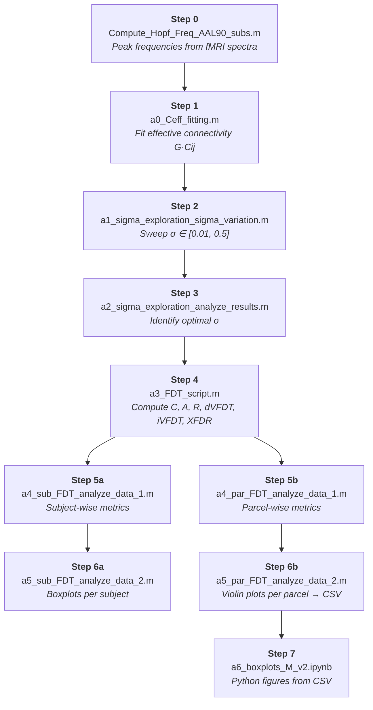

<div align="center">

# FDT Violations in Simulated Brain States

**Fluctuation-Dissipation Theorem signatures of Wakefulness vs. Deep Sleep N3**

[](https://doi.org/10.1103/PhysRevResearch.7.013301)
[](LICENSE)


</div>

---

Code for computing Fluctuation-Dissipation Theorem (FDT) violations in whole-brain Hopf bifurcation model simulations, comparing **Wakefulness** and **Deep Sleep (N3)** using resting-state fMRI data.

## Citation

> [!IMPORTANT]
> If you use this code, please cite:
>
> Monti, J. M., Perl, Y. S., Tagliazucchi, E., Kringelbach, M. L., & Deco, G. (2025). Fluctuation-dissipation theorem and the discovery of distinctive off-equilibrium signatures of brain states. *Physical Review Research*, 7(1). https://doi.org/10.1103/PhysRevResearch.7.013301

## Scientific Background

The FDT relates spontaneous fluctuations to the linear response of a system in thermal equilibrium. Violations of the FDT indicate non-equilibrium dynamics. This project applies the formalism of Cugliandolo & Kurchan (1994) to whole-brain simulations fit to fMRI data, probing whether sleep and wakefulness differ in their departure from equilibrium.

The model uses a network of Stuart-Landau (Hopf) oscillators coupled via structural connectivity, operating near the subcritical bifurcation (a = −0.02). Key observables:

| Symbol | Description | Reference |
|--------|-------------|-----------|
| **C(t,s)** | Correlation function | eq. 2.1, Cugliandolo 1994 |
| **A(t,s)** | Asymmetric correlator | eq. 2.10, Cugliandolo 1994 |
| **R(t,s)** | Response function | eq. 2.9, Cugliandolo 1994 |
| **X(t,s)** | FDT ratio | eq. 43, Lippiello 1999 |
| **dVFDT** | Differential FDT violation | eq. 1, Cugliandolo 1997 |
| **iVFDT** | Integral FDT violation | eq. 2, Cugliandolo 1997 |
| **XFDR** | Fluctuation-dissipation ratio | eq. 43, Lippiello 1999 |
| **iVFDT<sup>(var)</sup>** | Variance-normalised (z-scored) integral FDT violation | `z_Equations/Analytical_FDT_eqs_and_metrics_v1.tex` |

> [!NOTE]
> The variance-normalised versions `iVFDTsub_var`, `xiVFDTsub_var` divide the self (single-parcel) integral violation by the parcel stationary variance `V = C(t,t)`, yielding a dimensionless quantity invariant under parcel-wise rescaling. See `z_Equations/Analytical_FDT_eqs_and_metrics_v1.tex`.

## Dataset

Sleep fMRI dataset: **15 subjects**, **90 AAL parcels**, **TR = 2 s**.

| `CONDITION` | State |
|------------|-------|
| `1` | Wakefulness (W) |
| `2` | Deep Sleep N3 |

> [!NOTE]
> Data files go in `Data/Sleep/` and are **not** included in this repository.

## Requirements

**MATLAB**
- Signal Processing Toolbox
- Parallel Computing Toolbox *(optional, for `parfor` loops)*

**Python 3.x** — install via `pip install -r requirements.txt`
```
numpy  scipy  matplotlib  pandas  jupyter
```

### Third-party MATLAB files

The following files are stubs — download them separately and place them in the repo root:

| File | Source | License |
|------|--------|---------|
| `violinplot.m`, `Violin.m` | [bastibe/Violinplot-Matlab](https://github.com/bastibe/Violinplot-Matlab) | BSD 3-Clause |
| `shadedErrorBar.m` | [raacampbell/shadedErrorBar](https://github.com/raacampbell/shadedErrorBar) | BSD 3-Clause |
| `derivative.m` | [tamaskis/numerical\_differentiation-MATLAB](https://github.com/tamaskis/numerical_differentiation-MATLAB) | MIT |
| `demean.m` | [SPM toolbox](https://www.fil.ion.ucl.ac.uk/spm/) | GPL |

## Pipeline



### Step-by-step description

**Step 0 — Compute oscillation frequencies**  
`Data/Sleep/Compute_Hopf_Freq_AAL90_subs.m`  
Computes per-parcel peak frequencies from empirical fMRI power spectra.  
*Saves:* `hopf_freq_AAL90_COND_1_W.mat`, `hopf_freq_AAL90_COND_2_N3.mat`

---

**Step 1 — Fit effective connectivity**  
`a0_Ceff_fitting.m`  
Fits effective connectivity G·C_ij (group-level and per-subject) via linear Hopf model + gradient descent on FC and COV(τ). Noise amplitude fixed: σ = 0.12 (W), σ = 0.06 (N3).  
*Saves:* `Ceff_FC_Sleep_COND_*.mat`

---

**Step 2 — Explore noise amplitude σ**  
`a1_sigma_exploration_sigma_variation.m`  
Sweeps σ ∈ [0.01, 0.5], runs NSUBSIM = 100 simulations per σ value, computes MSE between empirical and simulated C(t,s).  
*Saves:* `sigmaexplore_Sleep_COND_*.mat`

---

**Step 3 — Analyze σ exploration**  
`a2_sigma_exploration_analyze_results.m`  
Plots D(σ) curves and identifies optimal σ per condition.

---

**Step 4 — Compute FDT observables**  
`a3_FDT_script.m`  
Main simulation script. Runs nonlinear Hopf simulations (NSUBSIM up to 10000), computes C(t,s), A(t,s), R(t,s), and derives dVFDT, iVFDT, XFDR — plus the variance-normalised iVFDT<sup>(var)</sup> (`iVFDTsub_var`, `xiVFDTsub_var`) — for each subject and parcel.  
*Saves:* `partial_Sleep_COND_*.mat` *(large files, excluded from repo)*

---

**Step 5a — Subject-wise FDT metrics**  
`a4_sub_FDT_analyze_data_1.m`  
Integrates FDT metrics over time (trapz), averages over parcels → per-subject scalar metrics.  
*Saves:* `metrics_SUB_*.mat`

**Step 5b — Parcel-wise FDT metrics**  
`a4_par_FDT_analyze_data_1.m`  
Same integration, averages over subjects → per-parcel scalar metrics.  
*Saves:* `metrics_PAR_*.mat`

---

**Step 6a — Plot subject-wise results**  
`a5_sub_FDT_analyze_data_2.m`  
Boxplots per subject (W vs N3). Optional CSV export (remove `return` statement to activate).

**Step 6b — Plot parcel-wise results**  
`a5_par_FDT_analyze_data_2.m`  
Violin + line plots per parcel. Exports CSV files for Python analysis.

---

**Step 7 — Additional figures (Python)**  
`a6_boxplots_M_v2.ipynb`  
Jupyter notebook for additional violin/boxplot figures using exported CSVs.

## Helper Functions

| File | Description |
|------|-------------|
| `hopf_int.m` | Linear Hopf: FC and covariance via Lyapunov/Sylvester equation |
| `hopf_linfit_group.m` | Gradient descent to fit group-average G·C_ij |
| `hopf_linfit_sub.m` | Same as above, per individual subject (initialized from group fit) |
| `hopf_sim_0init.m` | Discards first 2000/dt timesteps to find initial state z₀ |
| `hopf_sim_1start.m` | Runs Hopf Euler-Maruyama; saves x-component, force, noise at TR intervals |
| `funcs_FDT_CAR_sim.m` | Computes C(t,s), A(t,s), R(t,s) for a single simulation |
| `make_filt.m` | 2nd-order Butterworth bandpass filter [0.008, 0.08] Hz |
| `demean.m` | Removes mean along specified dimension |
| `derivative.m` | Numerical differentiation (Tamas Kis, 2021) |
| `shadedErrorBar.m` | Third-party shaded error bar plotting utility |
| `violinplot.m`, `Violin.m` | Third-party violin plot utilities |

## Key Parameters

| Parameter | Value | Description |
|-----------|-------|-------------|
| `ahopf` | −0.02 | Hopf bifurcation parameter (fixed, subcritical) |
| `CONDITION` | 1 or 2 | 1 = Wakefulness, 2 = Deep Sleep N3 |
| `SETSIGMA` | 0.12 (W) / 0.06 (N3) | Noise amplitude |
| `NSUBSIM` | up to 10 000 | Simulations per subject |
| `dt` | 0.1 · TR/2 | Integration timestep |
| `TR` | 2 s | fMRI repetition time |
| `Temp` | σ²/2 | Effective temperature |
| `DATAFILTER` | 0 or 1 | 0 = unfiltered, 1 = bandpass filtered |
| `FREQSUB` | 0 or 1 | 0 = mean power-spectrum freq, 1 = subject-specific |
| `HOPFINIT` | 0 or 1 | 0 = initialize once, 1 = initialize every simulation |

## Pre-computed Intermediate Files

> [!NOTE]
> The following files are included to allow skipping the fitting and σ-exploration steps (Steps 1–3):

- `Ceff_FC_Sleep_COND_1_NSUB_15_DFILT_0_FREQSUB_0.mat`
- `Ceff_FC_Sleep_COND_2_NSUB_15_DFILT_0_FREQSUB_0.mat`
- `sigmaexplore_Sleep_COND_1_NSUB_15_NSUBSIM_100_DFILT_0_FREQSUB_0.mat`
- `sigmaexplore_Sleep_COND_2_NSUB_15_NSUBSIM_100_DFILT_0_FREQSUB_0.mat`

## References

- Cugliandolo, L. F. & Kurchan, J. (1994). Analytical solution of the off-equilibrium dynamics of a long-range spin-glass model. *Physical Review Letters*, 71(1), 173–176.
- Cugliandolo, L. F. (1997). Out-of-equilibrium dynamics of classical and quantum complex systems. *Lecture notes*.
- Lippiello, E., Corberi, F. & Zannetti, M. (1999). Off-equilibrium generalization of the fluctuation dissipation theorem for Ising spins and measurement of the linear response function. *Physical Review E*, 71, 036104.

## License

This project is licensed under the MIT License — see the [LICENSE](LICENSE) file for details.

Third-party files (`violinplot.m`, `Violin.m`, `shadedErrorBar.m`, `derivative.m`, `demean.m`) are stubs pointing to their original sources; their respective licenses apply.
